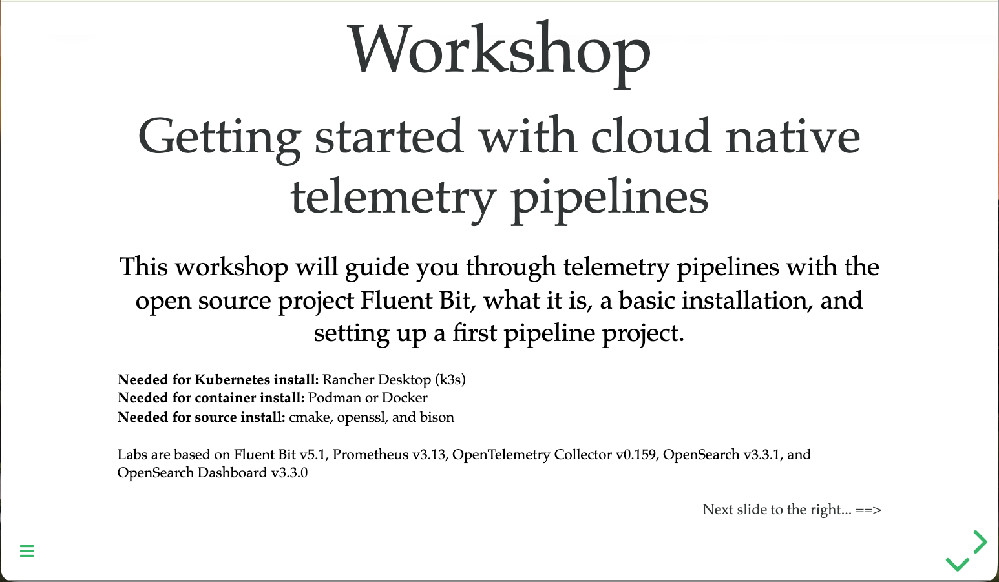

Try the [workshop online](https://o11y-workshops.gitlab.io/workshop-fluentbit):

Released versions
-----------------
See the tagged releases for the following versions of the workshop:

  - v4.4 - Workshop based on Fluent Bit v5.1, Prometheus v3.13, OpenTelemetry v0.159, and OpenSearch 3.3.1.

  - v4.3 - Workshop based on Fluent Bit v5.0, Prometheus v3.5, OpenTelemetry v0.156, and OpenSearch 3.3.1.

  - v4.2 - Workshop based on Fluent Bit v4.2, Prometheus v3.5, OpenTelemetry v0.136, and OpenSearch 3.3.1.

  - v4.1 - Workshop based on Fluent Bit v4.1, Prometheus v3.5, and OpenTelemetry v0.136.

  - v4.0 - Workshop based on Fluent Bit v4.0, Prometheus v3.4, and OpenTelemetry v0.136.

  - v3.3 - Workshop based on Fluent Bit v4.0, Prometheus v3.0, and OpenTelemetry v0.122.

  - v3.2 - Workshop based on Fluent Bit v3.2, Prometheus v3.0, and OpenTelemetry v0.115.

  - v3.1 - Workshop based on Fluent bit v3.1.
