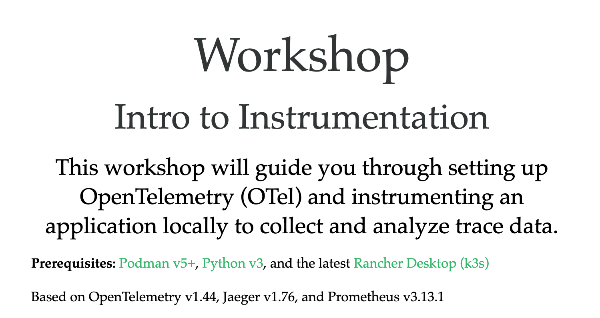

Try the [workshop online](https://o11y-workshops.gitlab.io/workshop-opentelemetry):

### Abstract
Great observability begins with great instrumentation! Learn how to adopt OpenTelemetry by instrumenting a sample
Python application with spans and metrics. Starting by exploring “out-of-the-box” automatic instrumentation then
progressing to manually instrumenting where needed to add metadata. You’ll leave with an understanding of how
telemetry travels from your application to the Collector and ready to bring OpenTelemetry to your project.

Released versions
-----------------
See the tagged releases for the following versions of the product:

- v0.3 - Workshop based on OpenTelemetry v1.44, Jaeger v1.76, Prometheus v3.13.1, and added Kubernetes (k3s) path.

- v0.2 - Workshop based on OpenTelemetry v1.29 and Prometheus v2.54.1.

- v0.1 - Workshop based on OpenTelemetry v1.25 and Prometheus v2.54.1.
