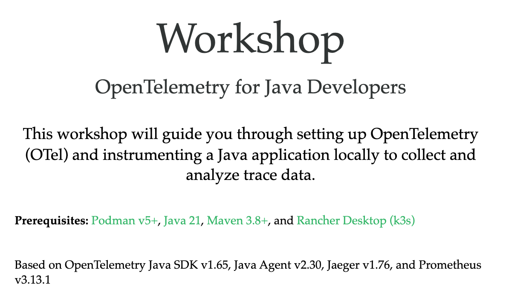

Try the [workshop online](https://o11y-workshops.gitlab.io/workshop-otel-developers):

Released versions
-----------------
See the tagged releases for the following versions of the workshop:

  - v1.1 - Workshop based on OpenTelemetry Java Agent v2.30, OpenTelemetry SDK v1.65, Jaeger v1.76, Prometheus v3.13.1,
           and added a Kubernetes (k3s) path.

  - v1.0 - Workshop based on OpenTelemetry Java Agent v2.13.0, OpenTelemetry SDK v1.57.0, Jaeger v1.67, and Prometheus v3.8.
