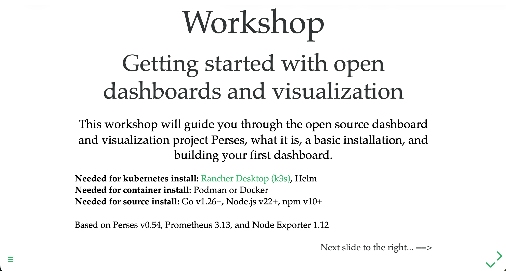

Try the [workshop online](https://o11y-workshops.gitlab.io/workshop-perses):

### Abstract
Are you ready for getting started with cloud native observability using open source dashboards and visualization? This
workshop will guide you through the open source project Perses, what it is, a basic installation, and building your
first dashboards. Learn how to install Perses on Kubernetes (k3s), in a container, or from source, explore the Perses
API and command line tooling, and work with the Perses dashboard specification. Buckle up for a fun ride as you learn
by doing, wiring Perses up to a Prometheus data source and building dashboards that visualize real metrics collected
from your own machine.

Released versions
-----------------
See the tagged releases for the following versions of the product:

 - v0.54 - Workshop based on Perses v0.54.x, Prometheus 3.13.x, and Node Exporter 1.12.x, with new Kubernetes (k3s) path.

 - v0.53 - Workshop based on Perses v0.53.x, Prometheus 3.11.x, and Node Exporter 1.11.x.

 - v0.52 - Workshop based on Perses v0.52.x, Prometheus 3.5.x, and Node Exporter 1.9.x.

 - v0.51 - Workshop based on Perses v0.51.0.

 - v0.50 - Workshop based on Perses v0.50.0.

 - v0.47 - Workshop based on Perses v0.47.1.

 - v0.42 - Workshop based on Perses v0.42.0.

 - v0.21 - Workshop based on Perses v0.21.0.
