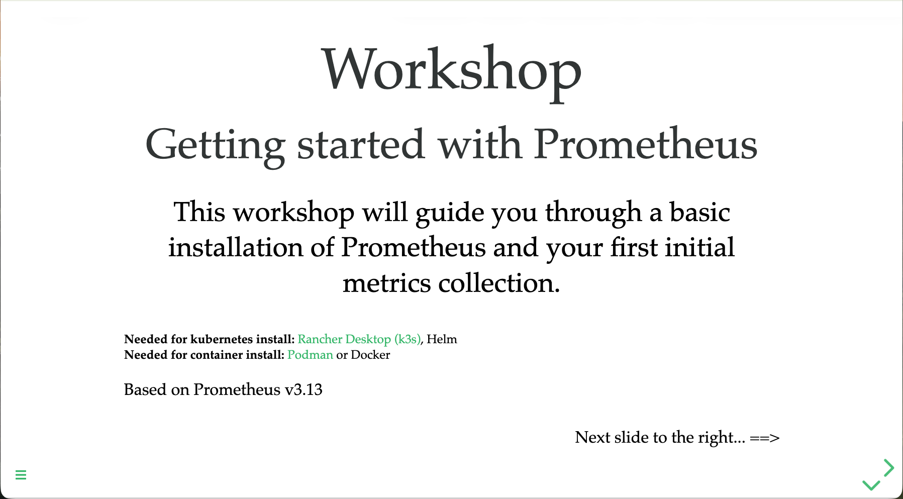

Try the [workshop online](https://o11y-workshops.gitlab.io/workshop-prometheus)

[Video introduction to workshop](https://youtu.be/KJvUyP4c1NQ) (from Open Source Edinburgh meetup)

### Abstract
Come learn about Prometheus, a free and open-source systems monitoring and alerting tool kit that enables you to discover,
collect, and query your observability data. Join us for this self-paced, online workshop designed to expand your knowledge
of open-source observability tools. This hands-on workshop is designed to help engineers and site reliability engineers
(SREs) who are interested in moving away from proprietary instrumentation and getting started with open-source observability.
During the workshop, you will install Prometheus, collect metrics, and learn how to effectively run it in your observability
stack. Get started today and hit the ground running with open-source observability!

Released versions
-----------------
See the tagged releases for the following versions of the product:

- v1.0 - Workshop based on Prometheus v3.13.1 with Kubernetes (k3s), container, and source installation paths.

- v0.9 - Workshop based on Prometheus v3.11.1.

- v0.8 - Workshop based on Prometheus v3.8.0.

- v0.7 - Workshop based on Prometheus v3.5.0.

- v0.6 - Workshop based on Prometheus v3.0.1.

- v0.5 - Workshop based on Prometheus v2.54.1.

- v0.4 - Workshop based on Prometheus v2.48.0.

- v0.3 - Workshop based on Prometheus v2.47.0.

- v0.2 - Workshop based on Prometheus v2.46.0.

- v0.1 - Workshop based on Prometheus v2.42.0.
